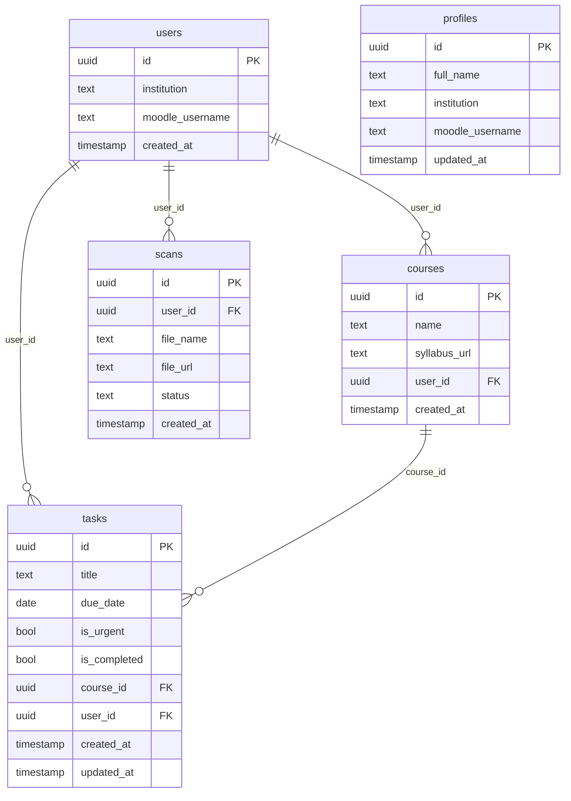

# UniTask — ניהול מטלות חכם לסטודנטים

[](https://unitask-delta.vercel.app)
[](https://github.com/tomercohn-pro/UniTask)

---

## 🔗 קישורים

| | קישור |
|---|---|
| 🌐 אפליקציה חיה | [unitask-delta.vercel.app](https://unitask-delta.vercel.app) |
| 💻 קוד מקור | [github.com/tomercohn-pro/UniTask](https://github.com/tomercohn-pro/UniTask) |

---

## 🔑 גישה לגרסה החיה

> **ניתן להירשם וליצור חשבון.**
> כנסו ל-[unitask-delta.vercel.app](https://unitask-delta.vercel.app) ולחצו **"כניסה עם Google"** — זה הכל.

---

## 📋 מה המוצר עושה

UniTask היא אפליקציית ניהול מטלות לסטודנטים, עם סנכרון מדומה ל-Moodle, סורק מסמכים AI וממשק RTL עברי מלא.

---

## 🎯 הבעיה שהפרויקט פותר

סטודנטים מנהלים מטלות ממספר קורסים בו-זמנית — חלק ב-Moodle, חלק בוואטסאפ, חלק בפתקים. אין מקום אחד שמרכז את כל המטלות, מזהיר על דדליינים קרובים, ומאפשר ניהול פשוט.

UniTask פותר את הבעיה עם דשבורד אחד שמסנכרן מטלות, מדרג לפי דחיפות, ומאפשר להוסיף מטלות ידנית או דרך סריקת מסמך.

---

## 👥 קהל יעד

סטודנטים לתואר ראשון הלומדים במוסדות אקדמיים בישראל — בעיקר מי שמשתמש ב-Moodle ומתקשה לעקוב אחרי כל המטלות מהקורסים השונים.

---

## ⚔️ מתחרים ובידול

| מתחרה | חיסרון |
|---|---|
| Moodle עצמו | ממשק ישן, אין מבט-על על כל הקורסים |
| Google Tasks / Todoist | לא מסונכרן עם Moodle, אין הקשר אקדמי |
| Excel / רשימת ידנית | עדכון ידני, אין התראות, אין ממשק נוח |
| וואטסאפ | אין מבנה, מטלות נקברות בשיחה |

**הבידול של UniTask:** מוצר מוקד לסטודנטים ישראלים — RTL מלא, חיבור ל-Moodle, סיווג לפי תואר ומוסד, וסורק AI שמחלץ מטלות מקבצי סילבוס.

---

## ✨ תכונות עיקריות

- **דשבורד מטלות** — הוספה, עריכה, מחיקה ושחזור מטלות
- **סנכרון Moodle** — שאיבת מטלות אוטומטית לפי התואר שהגדרת
- **סורק AI** — העלאת PDF/Word לזיהוי מטלות ותאריכים
- **ניהול קורסים** — סילבוס וניהול קורסים
- **כניסה עם Google** — אימות מאובטח דרך Supabase Auth
- **עיצוב רספונסיבי** — Sidebar בדסקטופ, Bottom Nav במובייל
- **מצב כהה** — תמיכה מלאה ב-Dark Mode

---

## 🔌 שירותים חיצוניים ואינטגרציות

| שירות | סוג | תפקיד במוצר |
|---|---|---|
| Google OAuth | אוטנטיקציה | התחברות משתמשים דרך חשבון גוגל |
| Supabase Auth | אוטנטיקציה | ניהול sessions, JWT |
| Supabase PostgreSQL | בסיס נתונים | שמירת משתמשים, מטלות, קורסים |
| Supabase RLS | אבטחה | Row Level Security — כל משתמש רואה רק את הנתונים שלו |
| Vercel | Hosting | דיפלוימנט אוטומטי |
| Mammoth.js | ספריית קצה | קריאת קבצי Word (.docx) בסורק |

---

## 🗄️ תרשים ERD — מודל הנתונים



---

## 🚀 התקנה והרצה מקומית

```bash
git clone https://github.com/tomercohn-pro/UniTask.git
cd UniTask
npm install
cp .env.example .env
# ערוך את .env עם פרטי Supabase שלך
npm run dev
```

### משתני סביבה (`.env`)

```
VITE_SUPABASE_URL=https://your-project.supabase.co
VITE_SUPABASE_ANON_KEY=your-anon-key
```

> לבדיקת הגרסה החיה אין צורך בהרשמה ידנית — לחץ "כניסה עם Google"

---

## 🛠️ טכנולוגיות

| טכנולוגיה | שימוש |
|---|---|
| React 19 + Vite | Frontend |
| React Router v7 | ניתוב |
| Supabase | Auth + PostgreSQL + RLS |
| Lucide React | אייקונים |
| Mammoth.js | קריאת קבצי Word |
| Vercel | Hosting |

---

## 📁 מבנה הפרויקט

```
src/
├── components/
│   ├── Sidebar.jsx        # ניווט דסקטופ
│   └── BottomNav.jsx      # ניווט מובייל
├── pages/
│   ├── DashboardPage.jsx  # דשבורד מטלות
│   ├── CoursesPage.jsx    # ניהול קורסים
│   ├── ScannerPage.jsx    # סורק AI
│   ├── SettingsPage.jsx   # הגדרות
│   ├── OnboardingPage.jsx # הגדרת פרופיל
│   └── LoginPage.jsx      # כניסה
├── data/
│   └── mockDegreeData.js  # נתוני תארים ומטלות (20 תארים)
├── styles/
│   └── globals.css        # Design tokens + Layout רספונסיבי
└── supabaseClient.js      # חיבור Supabase
```

---

## 🤖 תהליך ה-Vibe Coding — איך בנינו את UniTask עם AI

הפרויקט נבנה כמעט לחלוטין בשיטת **Vibe Coding** — תהליך פיתוח שבו המפתח מתאר מה הוא רוצה בשפה טבעית, וה-AI מייצר, מתקן ומשפר את הקוד בזמן אמת.

### הכלי המרכזי: Claude (Anthropic) דרך Cowork

כל שלב בפרויקט בוצע בשיחה רציפה עם Claude:

| שלב | מה ביקשנו מה-AI | מה ה-AI עשה |
|---|---|---|
| תכנון ראשוני | "אני רוצה אפליקציית ניהול מטלות לסטודנטים ישראלים" | הציע ארכיטקטורה, טבלאות Supabase, מבנה דפים |
| UI/UX | "תעצב מחדש את הדשבורד — זה נראה על הפנים" | שכתב CSS, הוסיף design tokens, RTL, dark mode |
| פיצ'רים | "הוסף bulk select עם מחיקה קבוצתית" | כתב את כל הלוגיקה, state management, ו-UI |
| דיפלוימנט | "העלה את זה ל-Vercel" | הריץ פקודות, תיקן שגיאות שם פרויקט, הגדיר env vars |
| באגים | "המסך נראה שבור בדסקטופ" | מצא CSS conflicting, תיקן flex layout |
| תיעוד | "תוסיף README מלא לפי הנחיות המרצה" | כתב את כל ה-README כולל ERD ב-Mermaid |

### למה זה עובד

השיטה מאפשרת לפתח מהר מאוד מבלי להיתקע על פרטים טכניים. המפתח מתמקד ב**מה** המוצר צריך לעשות, וה-AI מטפל ב**איך**. כל פיצ'ר שתואר בפסקה אחת הפך לקוד עובד תוך דקות.

---

## 👤 מפתח

**Tomer Cohen** — [tomercohn-pro](https://github.com/tomercohn-pro)
